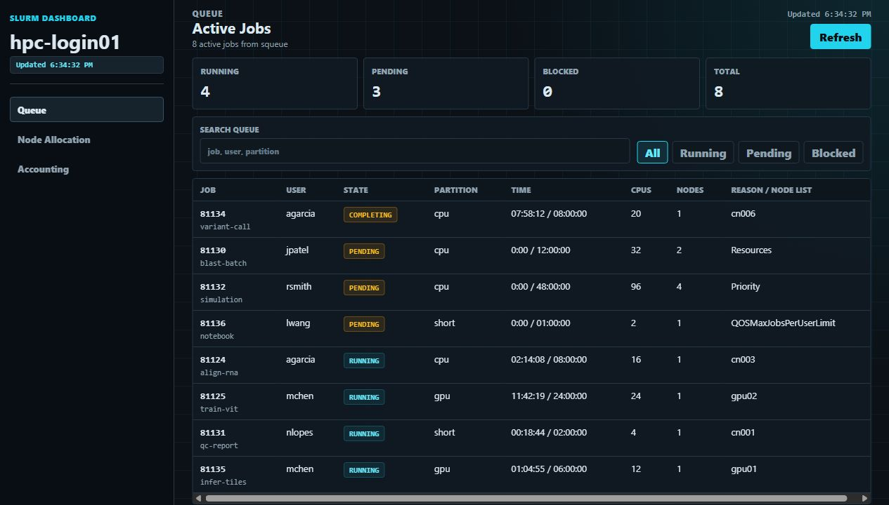
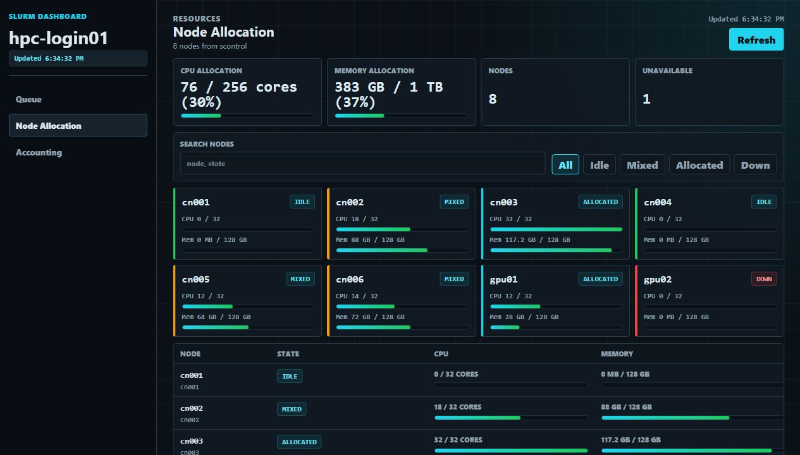
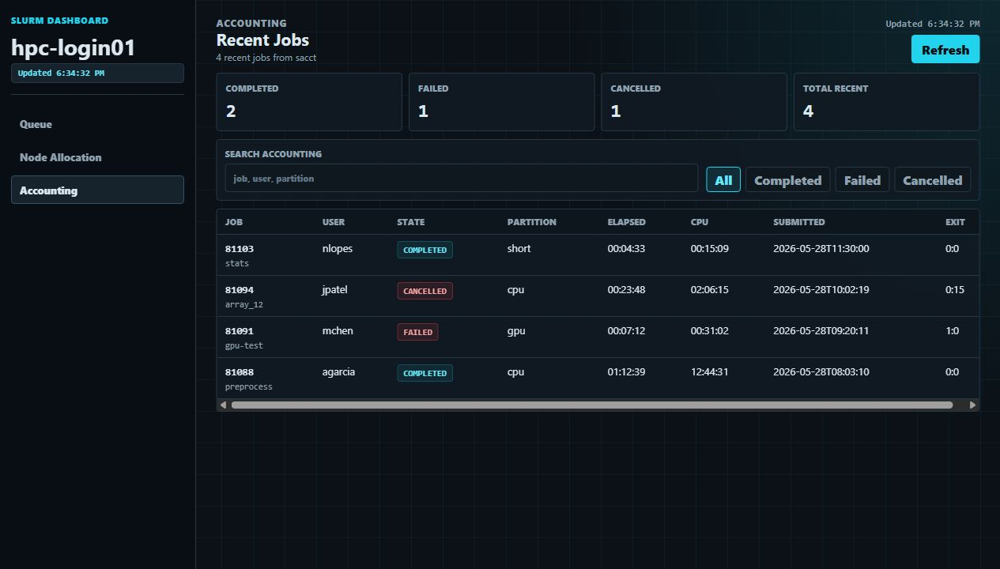

# Slurm Dashboard

A compact, npm-powered dashboard for Slurm clusters. The Node backend shells out to standard Slurm tools and serves a dense operations UI with separate pages for live queue activity, per-node resource allocation, and recent accounting history.

The app is intentionally small: no database, no build step, and no external runtime dependencies. It is meant to run close to a Slurm login or controller host where `squeue`, `sacct`, `sinfo`, and `scontrol` are already available.

## Screenshots

Screenshots use demo cluster data so the UI is visible outside a Slurm environment.







## Features

- Live queue page backed by `squeue`
- Per-node CPU and memory allocation page backed by `scontrol show nodes -o`
- Recent accounting page backed by `sacct`
- Dense dark console theme for scanning tables quickly
- Sidebar navigation with separate pages instead of in-page jumps
- Search, state filters, sort controls, and compact summary metrics
- Manual refresh plus a 60-minute idle data refresh
- Per-page command failure banners, so partial Slurm outages do not blank the dashboard

## Commands Used

- `squeue` for active queue data
- `sacct` for recent accounting data
- `sinfo` for supporting partition and node-state summaries
- `scontrol show nodes -o` for per-node CPU, memory, and state allocation

Each command is collected independently. If one command is unavailable or times out, the dashboard still renders the remaining data and reports the issue on the affected page.

## Requirements

- Node.js 18 or newer
- npm
- Slurm client commands available in `PATH`
- Slurm accounting access if you want `sacct` history

## Quick Start

```bash
npm install
npm start
```

Open `http://localhost:3018`.

## Configuration

Environment variables:

- `PORT`: HTTP port, defaults to `3018`
- `HOST`: bind address, defaults to `0.0.0.0`
- `SLURM_COMMAND_TIMEOUT_MS`: timeout per Slurm command, defaults to `12000`
- `SLURM_HISTORY_START`: `sacct -S` start value, defaults to `now-24hours`

Example:

```bash
PORT=8080 SLURM_HISTORY_START=now-7days npm start
```

## API

- `GET /api/health`: dashboard process health
- `GET /api/cluster`: collected Slurm data and per-command status

## Development

```bash
npm run check
npm run dev
```

`npm run dev` starts the same server as production. Static files are served from `public/`, and API collection logic lives in `server.js`.
